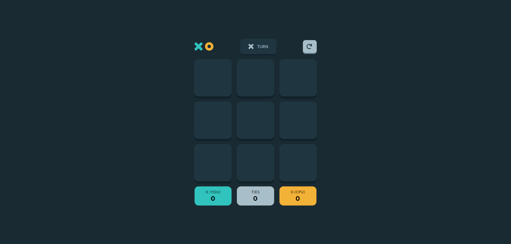

# Frontend Mentor - Tic Tac Toe solution

This is a solution to the [Tic Tac Toe challenge on Frontend Mentor](https://www.frontendmentor.io/challenges/tic-tac-toe-game-Re7ZF_E2v). Frontend Mentor challenges help you improve your coding skills by building realistic projects.

## Table of contents

- [Overview](#overview)
  - [The challenge](#the-challenge)
  - [Screenshot](#screenshot)
  - [Links](#links)
- [My process](#my-process)
  - [Built with](#built-with)
  - [What I learned](#what-i-learned)
  - [Continued development](#continued-development)
- [Author](#author)

## Overview

### The challenge

Users should be able to:

- View the optimal layout for the game depending on their device's screen size
- See hover states for all interactive elements on the page
- Play the game either solo vs the computer or multiplayer against another person
- **Bonus 1**: Save the game state in the browser so that it’s preserved if the player refreshes their browser
- **Bonus 2**: Instead of having the computer randomly make their moves, try making it clever so it’s proactive in blocking your moves and trying to win

### Screenshot

### Links

- [Solution URL](https://github.com/Antonvasilache/tic-tac-toe)
- [Live Site URL](https://tictactoe-av.netlify.app/)

## My process

1. Building the static page for desktop.
2. Creating the reducer and context functionality.
3. Switching static content to dynamic to prevent repetitive code.
4. Creating the functionality for the 2-player game option.
5. Creating the functionality for the player vs CPU game option, using randomized moves for CPU.
6. Adding local storage saving.
7. Making the app responsive for smaller screens.
8. Fixing inconsistencies related to mobile screens interaction.

### Built with

- Semantic HTML5 markup
- CSS custom properties
- Flexbox
- CSS Grid
- [React](https://reactjs.org/) - JS library

### What I learned

- Creating a gameplay loop using reactive state, where players can play the same game for multiple rounds, based on the game options they selected
- Creating dynamic styles that are controlled with React logic
- Devising a gameplay algorithm for games against CPU that works through multiple rounds of the game
- Saving the entire state application to local storage
- Handling style interactions based on different devices

### Continued development

- Creating effects that happen on component render based on complex conditions
- Handling dynamic styling using React
- Creating game algorithms that enable playing against CPU.
- For a future version, would like to replace the CPU random moves with a proactive way of trying to win.

## Author

- Website - [Antonvasilache.com](https://www.antonvasilache.com)
- Frontend Mentor - [@Antonvasilache](https://www.frontendmentor.io/profile/Antonvasilache)
